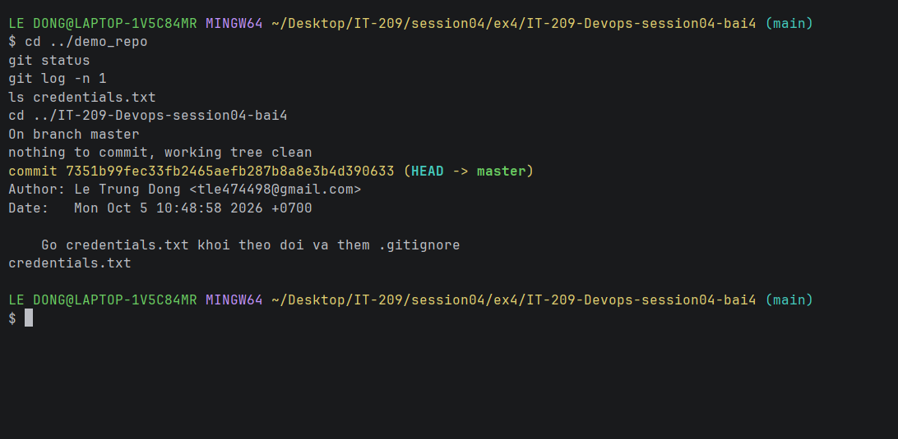

# Bài 4: Quản lý tệp tin bỏ qua (.gitignore) và Sửa lịch sử (Amend)

## 1. Bối cảnh
Lỡ commit nhầm file `credentials.txt` (chứa thông tin bảo mật). Cần gỡ khỏi sự theo dõi của Git nhưng **vẫn giữ file trên ổ cứng**, cấu hình để Git bỏ qua file này, và sửa lại thông điệp commit gần nhất.

## 2. Các bước thực hiện

### Bước 1: Gỡ file khỏi cache của Git
```bash
git rm --cached credentials.txt
```
- `--cached` chỉ xóa file khỏi **index (vùng staging/theo dõi)**, **không xóa file vật lý** trong thư mục làm việc.
- Không dùng `rm`/`del` của hệ điều hành nên file vẫn còn nguyên.

### Bước 2: Cấu hình `.gitignore`
```bash
echo "credentials.txt" >> .gitignore
git add .gitignore
```
Từ giờ Git tự động bỏ qua `credentials.txt` (cùng các file rác như `.DS_Store`, `Thumbs.db`, `*.log`).

### Bước 3: Sửa commit gần nhất bằng `--amend`
```bash
git commit --amend -m "Go credentials.txt khoi theo doi va them .gitignore"
```
`--amend` thay thế commit gần nhất bằng commit mới (đã bao gồm việc gỡ file và thêm `.gitignore`) với thông điệp đã sửa.

> Lưu ý: nếu commit đã được push lên GitHub, cần `git push --force-with-lease`. Ngoài ra, nếu mật khẩu thật đã bị lộ thì phải **đổi mật khẩu/khóa ngay**.

## 3. Kiểm tra

### `git status`
<!--STATUS-->
```
On branch master
nothing to commit, working tree clean
```
<!--/STATUS-->
→ `credentials.txt` không còn ở dạng Staged/Modified/Tracked.

### `git log -n 1`
<!--LOG-->
```
commit 7351b99fec33fb2465aefb287b8a8e3b4d390633
Author: Le Trung Dong <tle474498@gmail.com>
Date:   Mon Oct 5 10:48:58 2026 +0700

    Go credentials.txt khoi theo doi va them .gitignore
```
<!--/LOG-->
→ Thông điệp commit đã được sửa thành công bằng `--amend`.

## 4. Ảnh chụp minh chứng

